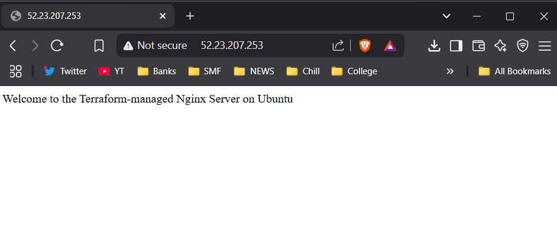

# terraform-nginx-ubuntu

## Objective:
 This is to demonstrate the ability to use Infrastructure as Code (IaC) principles by creating and managing AWS resources using Terraform

## Prerequisites
- Terraform Installed
- AWS CLI configured
- AWS Key Pair created
  

 ## Implementation
 1. Create a git repository with name terraform-nginx-ubuntu and create terraform files in the below directory structure
    - terraform-nginx-ubuntu
        - main.tf --> To provide Terraform configuration
        - variables.tf --> To define variables like instance type, key name etc..
        - outputs.tf --> To output the ip of instance
        - user_data.sh --> To Install Nginxand replace the default Nginx index page with a custom HTML page with Content: "Welcome to the Terraform-managed Nginx Server on Ubuntu"
    - In main.tf, provide the AMI Id of Ubuntu 24.04 LTS, name of the instance, security group with Inbound HTTP (port 80) and Inbound SSH (port 22)
    - In variables.tf --> provide the instance type - t2.micro
  2. Clone the git repository, move to the directory and configure aws
     ```
        aws configure
     ```
  3. Initialize terraform
     ```
        terraform init
     ```
     
  4. Review the execution plan
     ```
        terraform plan -var="key_name=skTF.pem"
     ```
  5. Apply the configuration
     ```
        terraform apply -var="key_name=skTF.pem"
     ```
  6. After provisioning, open your browser and go to:
     ```
       http://<public_ip>
     ```
     
  7. Destroy the infrastructure
     ```
       terraform destroy -var="key_name=skTF.pem"
     ```

